# Functional Spec — sci-calc

## Scope

| Unit | Components Covered | Source Stories |
|---|---|---|
| UNIT-001 (sci-calc) | CMP-001 through CMP-008 | S-1 through S-23 |

## Entity Relationships

```mermaid
erDiagram
    SuccessResponse {
        string status
        string operation
        object inputs
        float result
    }
    ErrorResponse {
        string status
        string operation
        object inputs
        object error
    }
    BinaryArithmeticRequest {
        float a
        float b
    }
    UnaryArithmeticRequest {
        float a
    }
    PowerRequest {
        float base
        float exponent
    }
    UnaryPowerRequest {
        float a
    }
    NthRootRequest {
        float a
        int n
    }
    TrigRequest {
        float a
        enum angle_unit
    }
    Atan2Request {
        float y
        float x
        enum angle_unit
    }
    LogRequest {
        float a
    }
    LogBaseRequest {
        float a
        float base
    }
    StatisticsRequest {
        array values
    }
    ConversionRequest {
        float value
        string from_unit
        string to_unit
    }

    BinaryArithmeticRequest ||--|| SuccessResponse : "produces"
    UnaryArithmeticRequest ||--|| SuccessResponse : "produces"
    PowerRequest ||--|| SuccessResponse : "produces"
    UnaryPowerRequest ||--|| SuccessResponse : "produces"
    NthRootRequest ||--|| SuccessResponse : "produces"
    TrigRequest ||--|| SuccessResponse : "produces"
    Atan2Request ||--|| SuccessResponse : "produces"
    LogRequest ||--|| SuccessResponse : "produces"
    LogBaseRequest ||--|| SuccessResponse : "produces"
    StatisticsRequest ||--|| SuccessResponse : "produces"
    ConversionRequest ||--|| SuccessResponse : "produces"
```

## State Machines

None. All entities are stateless request/response models — no lifecycle transitions.

## Workflows

### Request Processing Workflow

1. Receive HTTP request at API Layer (CMP-008)
2. Validate request body against Pydantic schema → INVALID_INPUT if invalid (BR-013)
3. Check operation name is known → NOT_FOUND if unknown (BR-014)
4. Route to appropriate engine based on URL path
5. Engine validates domain constraints (BR-001 through BR-009) → DOMAIN_ERROR or DIVISION_BY_ZERO if violated
6. Engine computes result using Python `math` stdlib
7. Check for overflow (BR-007): if result is inf from finite inputs → OVERFLOW
8. API Layer wraps result in SuccessResponse envelope (BR-012)
9. Return HTTP 200 with JSON body

### Degree Mode Workflow (Trigonometry)

1. If angle_unit == "degrees" and operation is a forward function (sin, cos, tan, sinh, cosh, tanh):
   - Convert input: `a_rad = a * pi / 180`
   - Compute: `result = math_function(a_rad)`
2. If angle_unit == "degrees" and operation is an inverse function (asin, acos, atan, atan2, asinh, acosh, atanh):
   - Compute: `result_rad = math_function(a)`
   - Convert output: `result = result_rad * 180 / pi`
3. If angle_unit == "radians": compute directly, no conversion

### Error Handling Workflow

1. Domain/validation error raised by engine → catch and return structured ErrorResponse (HTTP 400)
2. Pydantic validation failure → override handler returns INVALID_INPUT (BR-013)
3. Unknown path → 404 handler returns NOT_FOUND (BR-014)
4. Unexpected exception → global handler logs and returns INTERNAL_ERROR (BR-015)

## Rules Summary

| ID | Rule | Category | Applies to |
|---|---|---|---|
| BR-001 | Division/modulo by zero → DIVISION_BY_ZERO | validation | CMP-001 |
| BR-002 | sqrt(negative) → DOMAIN_ERROR | validation | CMP-002 |
| BR-003 | nth_root(negative, even n) → DOMAIN_ERROR | validation | CMP-002 |
| BR-004 | asin/acos outside [-1,1] → DOMAIN_ERROR | validation | CMP-003 |
| BR-005 | acosh(< 1) → DOMAIN_ERROR | validation | CMP-003 |
| BR-006 | atanh(\|a\| >= 1) → DOMAIN_ERROR | validation | CMP-003 |
| BR-007 | Finite input → infinite result → OVERFLOW | constraint | CMP-002, CMP-004 |
| BR-008 | log input must be positive → DOMAIN_ERROR | validation | CMP-004 |
| BR-009 | log base must be positive and ≠ 1 → DOMAIN_ERROR | validation | CMP-004 |
| BR-010 | Mode tie-breaking: smallest value wins | calculation | CMP-005 |
| BR-011 | Statistics minimum array size (mean/median/stdev/variance ≥ 1; stdev/variance ≥ 2) | validation | CMP-005 |
| BR-012 | Standard response envelope for all success responses | policy | CMP-008 |
| BR-013 | Override Pydantic 422 format → INVALID_INPUT | policy | CMP-008 |
| BR-014 | Unknown endpoint → NOT_FOUND | policy | CMP-008 |
| BR-015 | Catch-all → INTERNAL_ERROR (no stack trace in response) | policy | CMP-008 |
| BR-016 | Default angle_unit = radians when not specified | policy | CMP-003 |
| BR-017 | Conversion units must be valid for their category | validation | CMP-007 |

## Constants Registry

| Name | Value | Source |
|---|---|---|
| pi | math.pi | Python stdlib |
| e | math.e | Python stdlib |
| tau | math.tau | Python stdlib |
| inf | math.inf | Python stdlib |
| nan | math.nan | Python stdlib |
| golden_ratio | (1 + sqrt(5)) / 2 | Derived |
| sqrt2 | math.sqrt(2) | Python stdlib |
| ln2 | math.log(2) | Python stdlib |
| ln10 | math.log(10) | Python stdlib |
